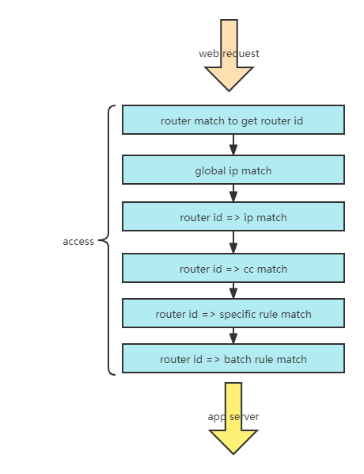

# 神荼网关
中文 | [English](./README_EN.md)

[管理端地址](https://github.com/jixindatech/shenshu)

## 依赖
- libinjection 编译需要python2.x环境.
- luahs 需要hyperscan dev的编译环境.

## 配置
- config.yaml 为主配置文件，gw.yaml为本地配置数据文件(不要修改)，
ss.yaml 是神荼的事件日志配置文件，主要支持file，rsyslog和kafka,zt.yaml忽略。
- doc/rsyslog目录下的es.conf是rsyslog的示例。
- doc/*_mapping.json 为事件存储在elasticsearch的数据结构,需要提前部署在es上。
- ### config.yaml配置说明
  - rsyslog是配置事件日志地址
  - redis 是配置数据的存储地址
  - config_type 是指定配置数据的访问方式， 有两种方式： yaml 本地文件(配置数据存放在gw.yaml中)
  redis 是根据上面的redis的地址拉取配置数据

- ### ss.yaml配置说明
  - *_log 中,file代表事件存在在error.log中， rsyslog 属性存在说明日志发送至rsyslog中，
  存在kafka的配置，即发送事件至kafka。
  - file一般是测试，rsyslog的配置对应config.yaml中的rsyslog。
  
## 安装
- make init 生成对应的nginx文件。
- make deps 生成对应的依赖。
- 本地测试时需要注意deps文件夹拷贝至luajit的路径里。
- ./bin/gw.lua 是本地目录运行环境， 其它运行目录在/usr/local/gw中。
- make install 时，需要将deps文件夹拷贝至运行目录。

## 简单流程图

## Contributing 
欢迎issue和star

## Discussion Group
QQ群: 254210748

##License
Unlicense

